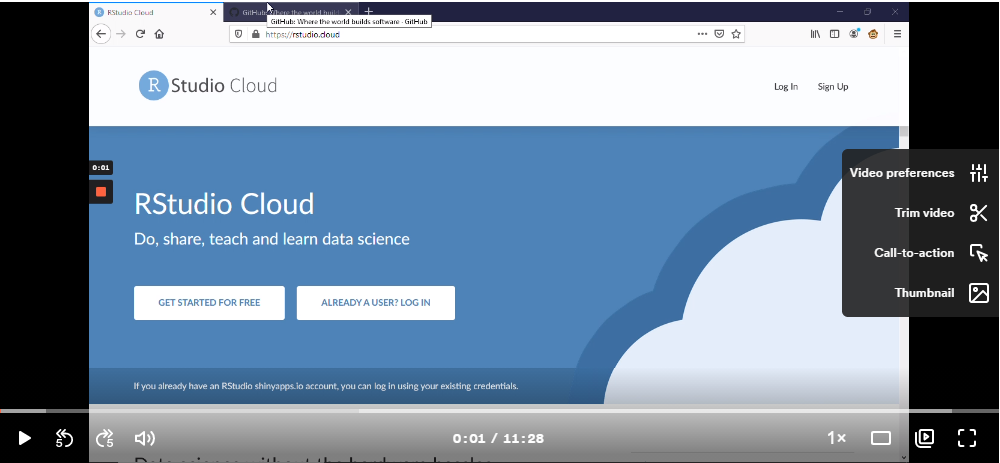
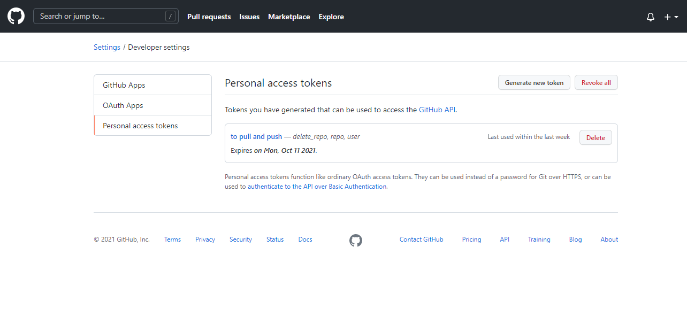
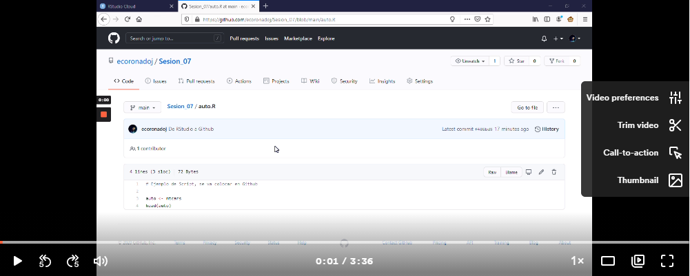

# Ejemplo 1. Conexión entre RStudio y Github

#### Objetivo
- Hacer uso de los recursos de la nube de RStudio y Github
- Utilizar como repositorio y control de cambios a Github
- Hacer el commit, push y pull

#### Requisitos
- Tener una cuenta de RStudio cloud
- Tener cuenta de Github

#### Desarrollo

Dentro de esta sesión podrás realizar una interacción entre RStudio y Github, lo que te permitirá trabajar con scripts en una interface de RStudio desde la nube, es decir, que se cargará en la ventada de tu explorador, con esto podrás trabajar de manera remota con scripts y poder alojarlos en algún repositorio.

- Primero vamos a configurar RStudio Cloud y Github, deberás seguir los pasos que se muestran en el siguiente video:

- Ahora vamos agregar un token de Github a RStudio CLoud para vincularlos, siguiendo las siguientes instrucciones: 

- En caso contrario, para hacer el `pull`, mandar archivos desde Github hacía RStudio se hará de la siguiente manera:

